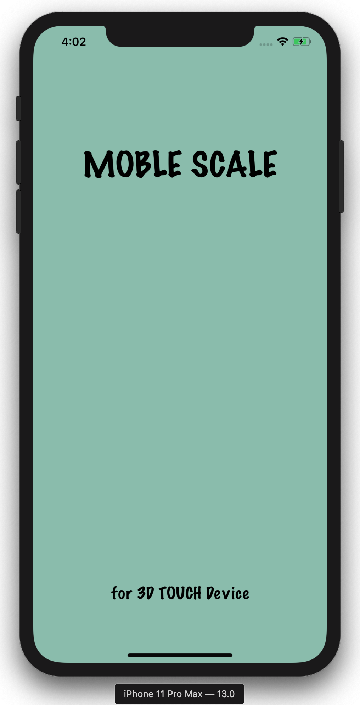
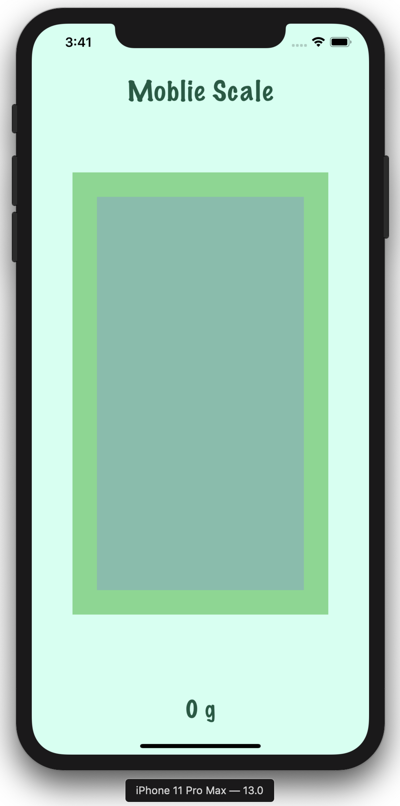

# :balance_scale: iOS MobileScale

> Portable Scale APP for iOS devices with 3DTouch

  

## :open_book: Introduction

**Moblie Scale is Portable Scale APP for iOS devices with 3DTouch**

### :iphone: App Features

* Measure the weight of an object on top of an iOS device that supports 3D touch

* The weight can be measured in units of 1g.

* 385g or higher atypical measurements are not supported.

## :desktop_computer: ​Build and Runtime Requirements

- Xcode 6.0 or later
- iOS 8.0 or later
- OS X v10.10 or later
- iCloud–enabled provisioning profile

## :copyright: ​License

This project is licensed under the MIT License - see the [LICENSE.md](./LICENSE) file for details

## :man_technologist: ​Authors

* **Seung Hun Han** - iOS Developer - [GITHUB](https://github.com/shhan730)

## :email: ​Contact

### **Seung Hun Han**(한승훈) - dev.shhan@gmail.com
